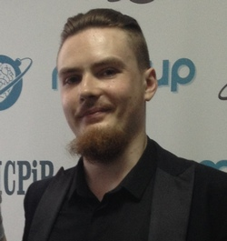

# rsschool-cv

# __Alexandr Bondarenko__

# __My Contact Info__:
* Location: Minsk, Belarus
* Email: 999manticora999@gmail.com
* Telegram: @Manticora888
* GitHub: AlexSakura5577
* Discord: AlexSakura#2772


# __About Me__

#### *Hi. I am 33 years old. I got interested in IT a long time ago. I majored in software engineering at the university about 10 years ago, but I left it without getting a degree. Then I took a course on web design (UX/UI), tried myself in creative professions. Superficially interested in C# and Java programming languages, as well as game development on Unity. I am currently learning JavaScript from tutorials and YouTube videos. In my free time I'm occupied with my personal growth and psychology. My hobby is music.*
#### *My long-term goal is to become a professional full-stack developer, in order to create websites, games and applications of any complexity quickly and with high quality. My main strengths are assiduity and pedantry, the ability to learn quickly and acquire new skills. I like to spend a lot of time developing algorithms. I love programming and solving tasks.*


# __Hard Skills__
* HTML5
* CSS3 (Flex, Grid, SASS/SCSS, BEM)
* JavaScript (Basic ES6+, Functional Programming, OOP, ES6+, DOM)
* Browser Automation Studio (BAS). XML, XPath, JSON.
* Git/GitHub
* Zeplin, Photoshop, Figma (for web development)
* Editor: VS Code

# __Soft Skills__
* I took a series of trainings at the International Center for Psychology and Development. Almost the whole line, I have decision-making skills, personality typology, communication and teamwork, critical thinking and planning.

#### *You can read it [here](https://www.mcpir.ru)*


___
# __Code Example__
```javascript
function highAndLow(str) {
    const parse = str.split(' ');
    return `${Math.max(...parse)} ${Math.min(...parse)}`;
};
```

___
# __Experience__
#### No commercial experience so far. But I believe that The Rolling Scopes School will help me to realize my ambitious goals.


# __Education__
* David Flanagan - JavaScript The Definitive Guide 6th and 7th Edition (textbooks)
* Vladlen Minin - JavaScript ES6 Full Course
[(YouTube)](https://www.youtube.com/c/VladilenMinin)
* Freelancer by Life - All about HTML & CSS (Front End)
[(YouTube)](https://www.youtube.com/c/FreelancerLifeStyle)
* Browser Automation Studio from a to z
[(YouTube)](https://www.youtube.com/channel/UC_fHAkJk4dNj8gnFbt55tHg)
* Mikhail Nepomnyashchiy - The Web Developer 2020 Competency
[(YouTube)](https://www.youtube.com/c/%D0%9C%D0%B8%D1%85%D0%B0%D0%B8%D0%BB%D0%9D%D0%B5%D0%BF%D0%BE%D0%BC%D0%BD%D1%8F%D1%89%D0%B8%D0%B9)
* The Rolling Scopes School – JavaScript/Front-end 2022Q1 (in progress)
[(YouTube)](https://www.youtube.com/c/RollingScopesSchool)

# __English__
### A1
#### I plan to improve my English to B1 in the course of half a year.
___

[](https://rs.school)
